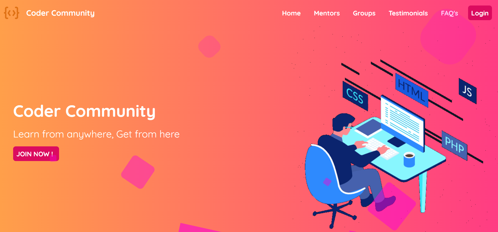

# Pencil Coder Community Page

This project is developed as part of hackathon organised by [FindCoder.io](https://www.findcoder.io/) to create landing page for the community.

This hackathon is in association with [Pencil](https://www.pensil.in/).

### Tech Stack Used:

 

Below are few snaps of project.

Find the hosted link below:

Link : [Coder Community](https://diliprathodrd.github.io/pencil-community-page/)

Credit:

I used content of the platform [coder community](https://web.codercommunity.io/) by **Hitesh Choudhary** and [iNeuron.ai](https://ineuron.ai/).

Thank you!

with love from [Dilip Rathod](https://www.findcoder.io/u/diliprathod)